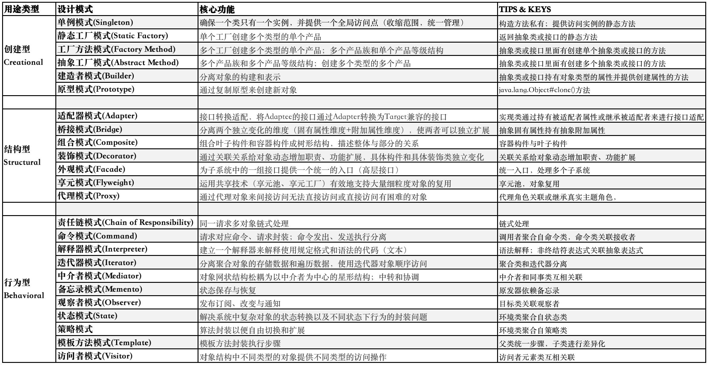
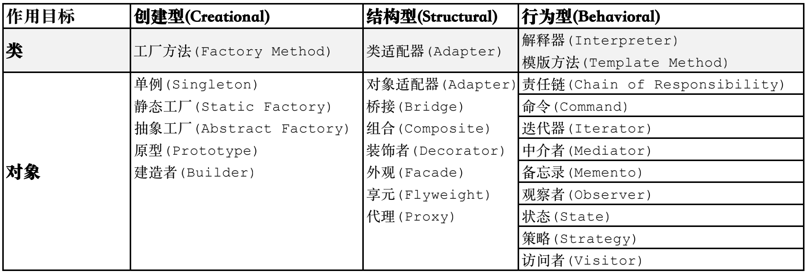
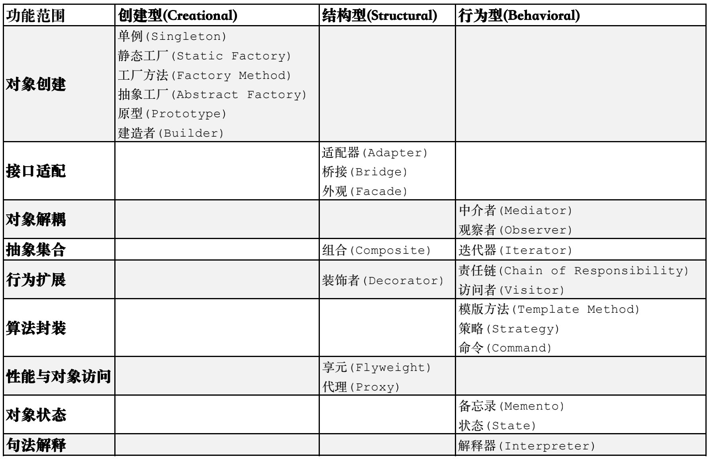
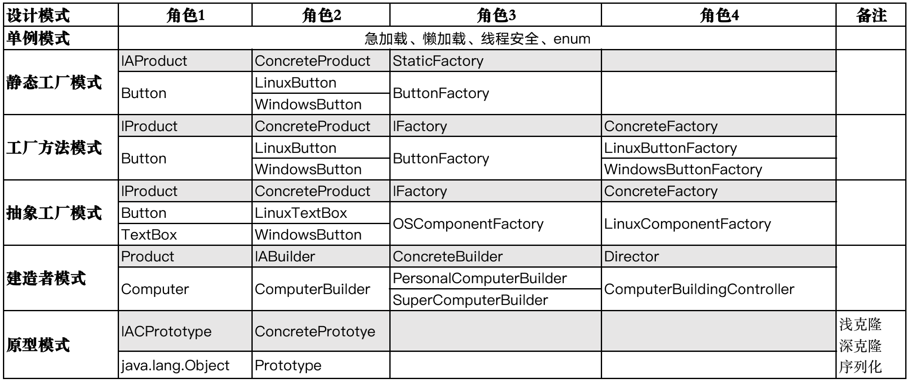
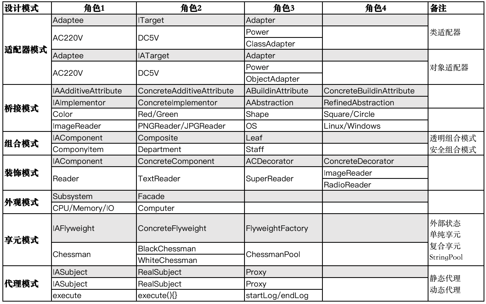
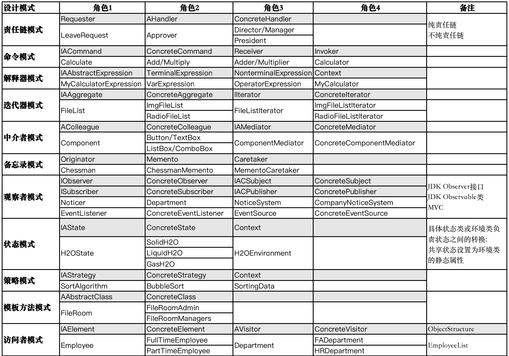

# 设计模式相关知识整理文档

# HelloWorld

- 主要内容：24种设计模式的核心点；各个设计模式简单易懂的示例；设计模式在JDK中的应用实例。

- 项目地址：https://github.com/Seakeer/sharing-design-pattern；包含各个示例的源码以及JDK中设计模式的实例。

- 约定说明：在描述某个设计模式的各个角色时， 使用前缀 `I` 表示该角色一般设计为接口，`A `表示该角色一般设计为抽象类，`IA `表示该角色一般设计为接口或抽象类，`IAC`
  则表示该角色可以设计为接口、抽象类或者普通类；不带前缀表示该角色一般设计为普通类。如下表所示：

| 前缀 | 示例       | 含义                                     |
  | :--- | ---------- | ---------------------------------------- |
| 缺省 | Product    | 产品角色一般设计为普通类                 |
| I    | IProduct   | 产品角色一般设计为接口                   |
| A    | AProduct   | 产品角色一般设计为抽象类                 |
| IA   | IAProduct  | 产品角色一般设计为接口或者抽象类         |
| IAC  | IACProduct | 产品角色可以设计为接口、抽象类或者普通类 |

# 目录

[TOC]

# 0. 设计与类关系

## 0.1. 设计与模式

### 设计

- **设计：**基于原理、准则（设计原则），**结合经验**（设计模式），优雅地实现功能
- **设计目标：**提升效率、节约成本（高稳定、可扩展、易维护）
- **设计思想：**面向过程(OPP)、面向对象(OOP)、面向切面(AOP)

### 模式

- **
  模式：**`模式是在特定环境下人们解决某类重复出现问题的一套成功或有效的解决方案(A pattern is a successful or efficient solution to a recurring problem within a context)`
- **软件模式：**`软件开发的总体指导思路或参照样板，如设计模式，架构模式，分析模式和过程模式`
- **设计模式：**`设计模式(Design Pattern)是一套被反复使用、多数人知晓的、经过分类编目的、代码设计经验的总结，使用设计模式是为了可重用代码、让代码更容易被他人理解并且保证代码可靠性`

## 0.2. 设计原则

- 提高一个软件系统的可维护性和可复用性是面向对象设计需要解决的核心问题之一
- 在面向对象设计中，可维护性的复用是以设计原则为基础的

| DP   | 设计原则                                            | 定义                                             |
| ---- | --------------------------------------------------- | ------------------------------------------------ |
| SRP  | 单一职责原则 (Single Responsibility Principle, SRP) | 一个类只负责一个功能领域中的相应职责             |
| OCP  | 开闭原则 (Open-Closed Principle, OCP)               | 软件实体应对扩展开放，而对修改关闭               |
| LSP  | 里氏代换原则 (Liskov Substitution Principle, LSP)   | 所有引用基类对象的地方能够透明地使用其子类的对象 |
| DIP  | 依赖倒转原则 (Dependence Inversion Principle, DIP)  | 抽象不应该依赖于细节，细节应该依赖于抽象         |
| ISP  | 接口隔离原则 (Interface Segregation Principle, ISP) | 使用多个专门的接口，而不使用单一的总接口         |
| CRP  | 合成复用原则 (Composite Reuse Principle, CRP)       | 尽量使用对象组合，而不是继承来达到复用的目的     |
| LoD  | 迪米特法则 (Law of Demeter, LoD)                    | 一个软件实体应当尽可能少地与其他实体发生相互作用 |

## 0.3. 类关系

分析设计模式时，需要关注和把握各个角色类之间的关系，从而深刻理解和应用设计模式。

| 类关系 | 解释                                                 | 实例                 | 备注                                                         |
| ------ | ---------------------------------------------------- | -------------------- | ------------------------------------------------------------ |
| 泛化   | is-a; 父类泛化出子类                                 | `人类泛化老师`       | `Human`是`Teacher`的父类                                     |
| 继承   | is-a; 子类继承自父类                                 | `老师继承人类`       | `Teacher`是`Human`的子类                                     |
| 实现   | 类实现接口                                           | `Human实现Humanable` | `Human实现Humanable`                                         |
| 组合   | contains-a;<br /> 整体与部分的关系，部分不可脱离整体 | `公司组合自部门`     | `Company`持有`Department`属性                                |
| 聚合   | has-a; <br />整体与部分的关系，部分可脱离整体        | `计算机聚合自CPU`    | `Computer`持有`CPU`属性                                      |
| 关联   | own; 拥有关系                                        | `老师关联学生`       | `Teacher`持有`Student`属性                                   |
| 依赖   | use; 使用关系                                        | `程序员依赖计算机`   | `Programmer`具有`Computer`局部变量;<br />`Programmer`的方法具有`Computer`参数;<br />`Programmer`调用`Computer`的静态方法 |

**类关系强度顺序：**泛化 = 继承 = 实现 > 组合 > 聚合 > 关联 > 依赖

# 1. 设计模式类型

## 1.0. 分类

- 根据用途分类

  - 创建型(Creational)：描述如何创建对象
  - 结构型(Structural)：描述如何实现类或对象的组合
  - 行为型(Behavioral)：描述类或对象怎样交互以及怎样分配职责

  

- 根据作用目标和目的分类

  - 类模式：处理类之间的关系
  - 对象模式：处理对象之间的关系

  

- 按功能范围和目的分类

  

## 1.1. 创建型

描述如何创建对象；

- **单例模式：**确保一个类只有一个实例，并提供一个全局访问点；
- **静态工厂模式：**单个工厂创建多个类型的单个产品；
- **工厂方法模式：**多个工厂创建多个类型的单个产品；多个产品族和单个产品等级结构；
- **抽象工厂模式：**多个产品族和多个产品等级结构；创建多个类型的多个产品；
- **建造者模式：**分离对象的构建和表示；
- **原型模式：**通过复制原型来创建新对象；

模式结构对比如下：



## 1.2. 结构型

描述如何实现类或对象的组合;

- **适配器模式：**接口转换适配，将Adaptee的接口通过Adapter转换为Target兼容的接口；缺省适配器（DefaultPattern）、双向适配器；
- **桥接模式：**分离两个独立变化的维度（固有属性维度+附加属性维度），使两者可以独立扩展；如分离彩色图形的形状和颜色两个维度；
- **组合模式：**组合叶子构件和容器构件成树形结构，描述整体与部分的关系；
- **装饰模式：**通过关联关系给对象动态增加职责、功能扩展，具体构件和具体装饰类独立变化
- **外观模式：**为子系统中的一组接口提供一个统一的入口（高层接口）；
- **享元模式：**运用共享技术（享元池、享元工厂）有效地支持大量细粒度对象的复用；
- **代理模式：**通过代理对象来间接访问无法直接访问或直接访问有困难的对象；

模式结构对比如下：



## 1.3. 行为型

描述类或对象怎样交互以及怎样分配职责；

- **责任链模式**：同一请求多对象链式处理；纯责任链：处理or不处理，不存在部分处理；
- **命令模式**：请求对应命令、请求封装；命令发出、发送执行分离；
- **解释器模式**：建立一个解释器来解释使用规定格式和语法的代码（文本）；
- **迭代器模式**：分离聚合对象的存储数据和遍历数据，使用迭代器对象顺序访问；
- **中介者模式：**对象网状结构松耦为以中介者为中心的星形结构；中转和协调；
- **备忘录模式**：状态保存与恢复；
- **观察者模式**：发布订阅、改变与通知；
- **状态模式**：解决系统中复杂对象的状态转换以及不同状态下行为的封装问题；
- **策略模式**：算法封装以便自由切换和扩展；
- **模板方法模式：**模板方法封装执行步骤；
- **访问者模式**：对象结构中不同类型的对象提供不同类型的访问操作；

模式结构对比如下：



# 2. 设计模式实例

## 2.1. JDK设计模式

### 2.1.1. 单例模式

#### @ Runtime

```java
package java.lang;

/**
 * Singleton;
 *
 * 急加载、单例
 */
public class Runtime {

  private static Runtime currentRuntime = new Runtime();

  private Runtime() {
  }

  public static Runtime getRuntime() {
    return currentRuntime;
  }
}
```

### 2.1.2. 静态工厂

#### @ ResourceBundle

- 省略工厂写法

```java
/**
 * StaticFactoryPattern;
 *
 * @see java.util.ResourceBundle                   --> IAProduct       1   抽象产品;
 * @see java.util.PropertyResourceBundle           --> ConcreteProduct 2_A 具体产品;
 * @see sun.util.resources.cldr.CalendarData       --> ConcreteProduct 2_B 具体产品;
 * @see java.util.ResourceBundle#getBundle(String) --> StaticFactory   3   静态工厂;
 *
 * @see java.nio.charset.Charset#forName(String)
 * @see java.util.Calendar#getInstance(Locale)
 */

public abstract class ResourceBundle {

  @CallerSensitive
  public static final ResourceBundle getBundle(String baseName,
                                               Locale locale) {
    return getBundleImpl(baseName, locale,
            getLoader(Reflection.getCallerClass()),
            getDefaultControl(baseName));
  }
}
```

### 2.1.3. 工厂方法

#### @ Charset & CharsetProvider

```java
/**
 * FactoryMethodPattern;
 *
 * @see java.nio.charset.Charset             --> IAProduct       1   抽象产品;
 * @see sun.nio.cs.UTF_8                     --> ConcreteProduct 2_A 具体产品;
 * @see sun.nio.cs.ext.GBK                   --> ConcreteProduct 2_B 具体产品;
 * @see java.nio.charset.spi.CharsetProvider --> IFactory        3   抽象工厂;
 * @see sun.nio.cs.StandardCharsets          --> ConcreteFactory 4_A 具体工厂;
 * @see sun.nio.cs.ext.ExtendedCharsets      --> ConcreteFactory 4_B 具体工厂;
 */

public abstract class CharsetProvider {
  public abstract Charset charsetForName(String charsetName);
}

public abstract class Charset implements Comparable<Charset> {

  public static Charset forName(String charsetName) {
    Charset cs = lookup(charsetName);
    if (cs != null)
      return cs;
    throw new UnsupportedCharsetException(charsetName);
  }
}
```

#### @ Thread & ThreadFactory

```java
package java.lang;

public class Thread implements Runnable {
  @Override
  public void run() {
    if (target != null) {
      target.run();
    }
  }
}
```

```java
package java.util.concurrent;

public interface ThreadFactory {
  Thread newThread(Runnable r);
}
```

- `Thread`                                                --->  IAProduct
  - defaultThread ---> ConcreteProduct
  - urlLoaderThread ---> ConcreteProduct
- `ThreadFactory`                                 ---> IFactory
  - `DefaultThreadFactory`           ---> ConcreteFactory
  - `URLLoaderThreadFactory`       ---> ConcreteFactory

### 2.1.4. 抽象工厂

#### @ Connection & Statement & Struct

```java
/**
 * AbstractFactoryPattern;
 *
 * @see java.sql.Statement                   --> IProduct        1_A   抽象产品;
 * @see java.sql.Struct                      --> IProduct        1_B   抽象产品;
 * @see com.mysql.cj.jdbc.StatementImpl      --> ConcreteProduct 2_A_1 具体产品;
 * @see ...                                  --> ConcreteProduct 2_A_2 具体产品;
 * @see javax.sql.rowset.serial.SerialStruct --> ConcreteProduct 2_B_1 具体产品;
 * @see ...                                  --> ConcreteProduct 2_B_2 具体产品;
 * @see java.sql.Connection                  --> IFactory        3     抽象工厂;
 * @see com.mysql.cj.jdbc.ConnectionImpl     --> ConcreteFactory 4_A   具体工厂;
 * @see ...                                  --> ConcreteFactory 4_B   具体工厂;
 */

public interface Connection extends Wrapper, AutoCloseable {

  Statement createStatement() throws SQLException;

  Struct createStruct(String typeName, Object[] attributes) throws SQLException;
}
```

### 2.1.5. 建造者模式

#### @ StringBuilder

**Relation**

```java
/**
 * BuilderPattern;
 *
 * @see java.lang.String                           --> Product         1   产品角色;
 * @see java.lang.AbstractStringBuilder#toString() --> IABuilder       2   抽象建造者;
 * @see java.lang.StringBuilder                    --> ConcreteBuilder 3_A 具体建造者;
 * @see java.lang.StringBuffer                     --> ConcreteBuilder 3_B 具体建造者;
 * @see ...                                        --> Director        4   指挥者角色;
 */
```

**Code**

```java
package java.lang;

abstract class AbstractStringBuilder implements Appendable, CharSequence {
  /**
   * The value is used for character storage.
   */
  char[] value;

  public AbstractStringBuilder append(double d) {
    FloatingDecimal.appendTo(d, this);
    return this;
  }

  @Override
  public abstract String toString();
}
```

```java
package java.lang;

public final class StringBuilder extends AbstractStringBuilder
        implements java.io.Serializable, CharSequence {

  @Override
  public String toString() {
    // Create a copy, don't share the array
    return new String(value, 0, count);
  }
}
```

```java
package java.lang;

public final class StringBuffer extends AbstractStringBuilder
        implements java.io.Serializable, CharSequence {

  @Override
  public synchronized String toString() {
    if (toStringCache == null) {
      toStringCache = Arrays.copyOfRange(value, 0, count);
    }
    return new String(toStringCache, true);
  }
}
```

### 2.1.6. 原型模式

#### @Object & Cloneable

```java
/**
 * PrototypePattern;
 *
 * @see java.lang.Object    --> IACPrototype      1 抽象原型;
 * @see java.util.ArrayList --> ConcretePrototype 2 具体原型;
 */

public class Object {

  /**
   * @return a clone of this instance.
   * @throws CloneNotSupportedException  if the object's class does not
   *               support the {@code Cloneable} interface. Subclasses
   *               that override the {@code clone} method can also
   *               throw this exception to indicate that an instance cannot
   *               be cloned.
   * @see java.lang.Cloneable
   */
  protected native Object clone() throws CloneNotSupportedException;
}
```

### 2.1.7. 适配器模式

#### @ InputStreamReader

> 对象适配器模式
>
> 适配字节流为字符流

**Relation**

```java
/**
 * AdapterPattern;
 *
 * @see java.io.InputStream,FileInputStream --> Adaptee       1 被适配者;
 * @see java.io.Reader                      --> IATarget      2 目标抽象类;
 * @see java.io.InputStreamReader           --> ObjectAdapter 3 适配器;
 */
```

**Code**

- Adapter

```java
package java.io;

public class InputStreamReader extends Reader {

  private final StreamDecoder sd;

  /**
   * Creates an InputStreamReader that uses the default charset.
   *
   * @param  in   An InputStream
   */
  public InputStreamReader(InputStream in) {
    super(in);
    try {
      sd = StreamDecoder.forInputStreamReader(in, this, (String) null); // ## check lock object
    } catch (UnsupportedEncodingException e) {
      // The default encoding should always be available
      throw new Error(e);
    }
  }

  public int read(char cbuf[], int offset, int length) throws IOException {
    return sd.read(cbuf, offset, length);
  }
}
```

- ITarget

```java
package java.io;

/**
 * 字符流 read ---> ITarget
 */
public abstract class Reader implements Readable, Closeable {

  abstract public int read(char cbuf[], int off, int len) throws IOException;
}
```

- Adaptee

```java
package java.io;

/**
 * 字节流，被适配的接口(方法)read() ---> 适配为字符流
 */
public abstract class InputStream implements Closeable {

  public int read(byte b[], int off, int len) throws IOException {
  }
}
```

### 2.1.8. 桥接模式

#### @ Handler & Formatter

**Relation**

```java
/**
 * BridgePattern;
 *
 * @see java.util.logging.Formatter       --> IAAdditiveAttribute       1 抽象附加属性;
 * @see java.util.logging.SimpleFormatter --> ConcreteAdditiveAttribute 2 具体附加属性;
 * @see java.util.logging.Handler         --> ABuildinAttribute         3 抽象固有属性;
 * @see java.util.logging.ConsoleHandler  --> ConcreteBuildinAttribute  4 具体固有属性;
 */
```

**Code**

```java
package java.util.logging;

public abstract class Handler {

  private volatile Formatter formatter;

  public synchronized void setFormatter(Formatter newFormatter) throws SecurityException {
    checkPermission();
    // Check for a null pointer:
    newFormatter.getClass();
    formatter = newFormatter;
  }

  public Formatter getFormatter() {
    return formatter;
  }

  public abstract void publish(LogRecord record);
}
```

```java
package java.util.logging;

public class StreamHandler extends Handler {

  @Override
  public synchronized void publish(LogRecord record) {
    if (!isLoggable(record)) {
      return;
    }
    String msg;
    try {
      msg = getFormatter().format(record);
    } catch (Exception ex) {
      // We don't want to throw an exception here, but we
      // report the exception to any registered ErrorManager.
      reportError(null, ex, ErrorManager.FORMAT_FAILURE);
      return;
    }

    try {
      if (!doneHeader) {
        writer.write(getFormatter().getHead(this));
        doneHeader = true;
      }
      writer.write(msg);
    } catch (Exception ex) {
      // We don't want to throw an exception here, but we
      // report the exception to any registered ErrorManager.
      reportError(null, ex, ErrorManager.WRITE_FAILURE);
    }
  }
}
```

### 2.1.9. 组合模式

#### @ HashMap

> 开放组合模式

**Relation**

```java
/**
 * CompositePattern;
 *
 * @see java.util.Map                         --> IAComponent 1 抽象构件;
 * @see java.util.HashMap                     --> Composite   2 容器构件;
 * @see java.util.Collections.UnmodifiableMap --> Leaf        3 叶子构件;
 */
```

**Code**

```java
package java.util;

public interface Map<K, V> {

  void putAll(Map<? extends K, ? extends V> m);
}
```

```java
public class HashMap<K, V> extends AbstractMap<K, V>
        implements Map<K, V>, Cloneable, Serializable {

  public void putAll(Map<? extends K, ? extends V> m) {
    putMapEntries(m, true);
  }
}
```

```java
public class Collections {

  private static class UnmodifiableMap<K, V> implements Map<K, V>, Serializable {

    public void putAll(Map<? extends K, ? extends V> m) {
      throw new UnsupportedOperationException();
    }
  }
}
```

### 2.1.10. 装饰者模式

#### @ FilterInputStream

**Role**

```java
/**
 * DecoratorPattern;
 *
 * @see java.io.InputStream         --> IAComponent       1   抽象构件;
 * @see java.io.FileInputStream     --> ConcreteComponent 2   具体构件;
 * @see java.io.FilterInputStream   --> ACDecorator       3   抽象装饰者;
 * @see java.io.BufferedInputStream --> ConcreteDecorator 4_A 具体装饰者;
 * @see java.io.DataInputStream     --> ConcreteDecorator 4_B 具体装饰者;
 */
```

**Code**

```java
package java.io;

public abstract class InputStream implements Closeable {

  public abstract int read() throws IOException;
}
```

```java
public class FileInputStream extends InputStream {

  public int read() throws IOException {
    return read0();
  }

  private native int read0() throws IOException;
}

```

```java
package java.io;

public class FilterInputStream extends InputStream {
  /**
   * The input stream to be filtered.
   */
  protected volatile InputStream in;

  protected FilterInputStream(InputStream in) {
    this.in = in;
  }

  public int read() throws IOException {
    return in.read();
  }
}
```

```java
public class BufferedInputStream extends FilterInputStream {

  protected volatile byte buf[];

  public BufferedInputStream(InputStream in, int size) {
    super(in);
    if (size <= 0) {
      throw new IllegalArgumentException("Buffer size <= 0");
    }
    buf = new byte[size];
  }

  public synchronized int read() throws IOException {
    if (pos >= count) {
      fill();
      if (pos >= count)
        return -1;
    }
    return getBufIfOpen()[pos++] & 0xff;
  }

}

```

```java
public class DataInputStream extends FilterInputStream implements DataInput {

  public DataInputStream(InputStream in) {
    super(in);
  }

  public final boolean readBoolean() throws IOException {
    int ch = in.read();
    if (ch < 0)
      throw new EOFException();
    return (ch != 0);
  }

  public final float readFloat() throws IOException {
    return Float.intBitsToFloat(readInt());
  }
}

```

### 2.1.11. 门面模式

#### @ RequestFacade

```java
/**
 * FacadePattern;
 *
 * @see jakarta.faces.context.FacesContextFactory   --> Subsystem 1_A 子系统;
 * @see jakarta.faces.lifecycle.Lifecycle           --> Subsystem 1_B 子系统;
 * @see jakarta.servlet.ServletConfig               --> Subsystem 1_C 子系统;
 * @see jakarta.faces.webapp.FacesServlet#destroy() --> Facade    2   外观角色;
 * @see org.apache.catalina.connector.Request       --> Subsystem 1   子系统;
 * @see org.apache.catalina.connector.RequestFacade --> Facade    2   外观角色;
 */

@MultipartConfig
public final class FacesServlet implements Servlet {

  @Override
  public void destroy() {
    facesContextFactory = null;
    lifecycle = null;
    servletConfig = null;
    uninitHttpMethodValidityVerification();
  }
}

public class RequestFacade implements HttpServletRequest {

  @Override
  public String getHeader(String name) {
    if (request == null) {
      throw new IllegalStateException(
              sm.getString("requestFacade.nullRequest"));
    }
    return request.getHeader(name);
  }
}
```

### 2.1.12. 享元模式

#### @ IntegerCache

```java
/**
 * FlyweightPattern;
 *
 * @see java.lang.Number               --> IAFlyweight       1   抽象享元;
 * @see ...  -128 - 0                  --> ConcreteFlyweight 2_A 具体享元;
 * @see ...  0 - 127                   --> ConcreteFlyweight 2_B 具体享元;
 * @see java.lang.Integer.IntegerCache --> FlyweightFactory  3   享元工厂;
 */
```

```java
package java.lang;

public final class Integer extends Number implements Comparable<Integer> {

  public static Integer valueOf(int i) {
    if (i >= IntegerCache.low && i <= IntegerCache.high)
      return IntegerCache.cache[i + (-IntegerCache.low)];
    return new Integer(i);
  }

  private static class IntegerCache {
    static final int low = -128;
    // high value may be configured by property
    // 127: default & min
    static final int high;
    static final Integer cache[];

    static {
      // omit the code that init high

      cache = new Integer[(high - low) + 1];
      int j = low;
      for (int k = 0; k < cache.length; k++)
        cache[k] = new Integer(j++);
      // range [-128, 127] must be interned (JLS7 5.1.7)
      assert IntegerCache.high >= 127;
    }

    private IntegerCache() {
    }
  }
}
```

#### @ NumberCache

- ByteCache
- CharacterCache
- ShortCache
- IntegerCache
- LongCache

### 2.1.13. 代理模式

#### @ Proxy

**JDK动态代理**

```java
/**
 * DynamicProxy;
 *
 * @see Business                            --> IASuject     1 抽象主题;
 * @see Manufacturer                        --> RealSubject  2 真实主题;
 * @see java.lang.reflect.Proxy             --> Proxy        3 代理;
 * @see java.lang.reflect.InvocationHandler --> AbstractProxyHandler;
 * @see DynamicProxyHandler                 --> ProxyHandler;
 */
public class DynamicProxyPatternMain {

  public static void main(String[] args) {
    // 保存代理类class文件
    // System.setProperty("sun.misc.ProxyGenerator.saveGeneratedFiles", "true");
    Business business = new Manufacturer();
    InvocationHandler invocationHandler = new DynamicProxyHandler(business);
    ClassLoader classLoader = business.getClass().getClassLoader();
    // 反射创建代理类
    Business proxy = (Business) Proxy.newProxyInstance(classLoader, business.getClass().getInterfaces(), invocationHandler);
    proxy.sellProduct();
  }
}
```

- JDK 源码动态代理实例

```java
package com.sun.jmx.mbeanserver;

public class DefaultMXBeanMappingFactory extends MXBeanMappingFactory {

  private static final class CompositeBuilderViaProxy
          extends CompositeBuilder {

    final Object fromCompositeData(CompositeData cd,
                                   String[] itemNames,
                                   MXBeanMapping[] converters) {
      // Subject
      final Class<?> targetClass = getTargetClass();
      return
              // Proxy
              Proxy.newProxyInstance(targetClass.getClassLoader(),
                      new Class<?>[]{targetClass},
                      new CompositeDataInvocationHandler(cd));
    }
  }
}
```

**CGLIB**

```java
/**
 * CGLIB的动态代理;
 * @see Business                                 --> IASuject            1 抽象主题;
 * @see Manufacturer                             --> RealSubject         2 真实主题;
 * @see DynamicProxyHandler#proxyEnhancer(Class) --> Proxy,ProxyHandler  3 代理;
 * @see net.sf.cglib.proxy.MethodInterceptor     --> AbstractProxyHandler;
 */
public class DynamicProxyPatternMain {

  public static void main(String[] args) {
    //System.setProperty(DebuggingClassWriter.DEBUG_LOCATION_PROPERTY, "src/main/resources");
    DynamicProxyHandler proxyHandler = new DynamicProxyHandler();
    Business dynamicProxy = proxyHandler.proxyEnhancer(Manufacturer.class);
    dynamicProxy.sellProduct();
  }
}


public class DynamicProxyHandler implements MethodInterceptor {

  @SuppressWarnings("unchecked")
  public <T> T proxyEnhancer(Class<T> clz) {
    Enhancer enhancer = new Enhancer();
    enhancer.setSuperclass(clz);
    enhancer.setCallback(this);
    return (T) enhancer.create();
  }

  @Override
  public Object intercept(Object obj, Method method, Object[] args, MethodProxy proxy) throws Throwable {
    System.out.println("pre-sale service");
    Object o = proxy.invokeSuper(obj, args);
    System.out.println("after-sale service");
    return o;
  }
}
```

### 2.1.14. 责任链模式

#### @ Filter

```java
/**
 * ChainOfResponsibilityPattern;
 *
 * @see jakarta.servlet.ServletResponse
 * @see jakarta.servlet.ServletRequest
 * @see jakarta.servlet.Filter
 * @see jakarta.servlet.FilterChain
 * @see jakarta.servlet.FilterConfig
 * @see org.apache.catalina.connector.RequestFacade            --> Requester       1   请求者;
 * @see org.apache.catalina.filters.FilterBase                 --> AHandler        2   抽象处理者;
 * @see org.apache.catalina.filters.HttpHeaderSecurityFilter   --> ConcreteHandler 3_A 具体处理者;
 * @see org.apache.catalina.filters.SetCharacterEncodingFilter --> ConcreteHandler 3_B 具体处理者;
 * @see org.apache.catalina.filters.FailedRequestFilter        --> ConcreteHandler 3_C 具体处理者;
 */

public interface Filter {

  public default void init(FilterConfig filterConfig) throws ServletException {
  }

  public void doFilter(ServletRequest request, ServletResponse response,
                       FilterChain chain) throws IOException, ServletException;

  public default void destroy() {
  }
}
```

- `jakarta.servlet.Filter` 即是原JavaEE的API`javax.servlet.Filter`
- 2017-08，Oracle将 Java EE(Java Enterprise Edition)移交给开源组织 Eclipse 基金会; 2018-03-05, Eclipse宣布将JavaEE被更名为JakartaEE(雅加达).

### 2.1.15. 命令模式

#### @ Runnable & Thread

- `java.lang.Runnable`   --> IACommand 1 抽象命令类;
- Runnable的实现类 --> ConcreteCommand 2 具体命令类;
- 具体操作的数据 --> Receiver 3 接收者;
- `java.lang.Thread`       --> Invoker 4 调用者;

```java
/**
 * CommandPatternJdk;
 *
 * @see java.lang.Runnable --> IACommand       1 抽象命令类;
 * @see TicketSaleTask     --> ConcreteCommand 2 具体命令类;
 * @see Ticket             --> Receiver        3 接收者;
 * @see TicketWindow       --> Invoker         4 调用者;
 */

public class Thread implements Runnable {

  // IACommand
  /* What will be run. */
  private Runnable target;

  @Override
  public void run() {
    if (target != null) {
      target.run();
    }
  }
}
```

### 2.1.16. 解释器模式

#### @ ValueExpression & ELResolver

```java
/**
 * InterpreterPattern;
 *
 * @see jakarta.el.ValueExpression#getValue(ELContext)       --> IAAbstractExpression  1 抽象表达式;
 * @see org.apache.el.ValueExpressionImpl                    --> TerminalExpression    2 终结符表达式;
 * @see jakarta.servlet.jsp.jstl.core.IndexedValueExpression --> NonterminalExpression 3 非终结符表达式;
 * @see jakarta.el.ELContext                                 --> Context               4 环境类;
 * @see ...
 * @see jakarta.el.ELResolver#getValue                       --> IAAbstractExpression  1 抽象表达式;
 * @see jakarta.el.ListELResolver                            --> TerminalExpression    2 终结符表达式;
 * @see jakarta.el.CompositeELResolver                       --> NonterminalExpression 3 非终结符表达式;
 * @see jakarta.el.ELContext                                 --> Context               4 环境类;
 * @see jakarta.el.StandardELContext
 * @see org.apache.jasper.el.JasperELResolver
 */

public final class IndexedValueExpression extends ValueExpression {

  private static final long serialVersionUID = 1L;

  protected final Integer i;
  protected final ValueExpression orig;

  @Override
  public Object getValue(ELContext context) {
    Object base = this.orig.getValue(context);
    if (base != null) {
      context.setPropertyResolved(false);
      return context.getELResolver().getValue(context, base, i);
    }
    return null;
  }
}
```

### 2.1.17. 迭代器模式

#### @ Iterator

```java
/**
 * IteratorPattern;
 *
 * @see java.util.Collection         --> IAAggregate       1   抽象聚合类;
 * @see java.util.ArrayList          --> ConcreteAggregate 2_A 具体聚合类;
 * @see java.util.LinkedList         --> ConcreteAggregate 2_B 具体聚合类;
 * @see java.util.Iterator           --> IIterator         3   抽象迭代器;
 * @see java.util.ArrayList.Itr      --> ConreteIterator   4_A 具体迭代器;
 * @see java.util.LinkedList.ListItr --> ConreteIterator   4_B 具体迭代器;
 */
```

### 2.1.18. 中介者模式

#### @ Executor & ForkJoinPool

```java
/**
 * MediatorPattern;
 *
 * @see java.lang.Runnable                       --> AColleague        1   抽象同事类;
 * @see j.u.c.ForkJoinTask.RunnableExecuteAction --> ConcreteColleague 2_A 具体同事类;
 * @see j.u.c.ForkJoinTask.AdaptedRunnableAction --> ConcreteColleague 2_B 具体同事类;
 * @see j.u.c.Executor#execute(Runnable)         --> IAMediator        3   抽象中介者类;
 * @see java.util.concurrent.ForkJoinPool        --> ConcreteMediator  4   具体中介者类;
 */

@sun.misc.Contended
public class ForkJoinPool extends AbstractExecutorService {

  public void execute(Runnable task) {
    if (task == null)
      throw new NullPointerException();
    ForkJoinTask<?> job;
    if (task instanceof ForkJoinTask<?>) // avoid re-wrap
      job = (ForkJoinTask<?>) task;
    else
      job = new ForkJoinTask.RunnableExecuteAction(task);
    externalPush(job);
  }
}
```

### 2.1.19. 备忘录模式

#### @ Instance

```java
/**
 * MementoPattern;
 *
 * @see java.time.Instant#seconds --> Originator 1 原发器;
 * @see java.time.Instant         --> Memento    2 备忘录;
 * @see java.time.Instant         --> Caretaker  3 负责人;
 */

public final class Instant
        implements Temporal, TemporalAdjuster, Comparable<Instant>, Serializable {

  /**
   * The number of seconds from the epoch of 1970-01-01T00:00:00Z.
   */
  private final long seconds;

  public static Instant now() {
    return Clock.systemUTC().instant();
  }
}
```

### 2.1.20. 观察者模式

#### @ ListSelectionListener

```java

/**
 * ObserverPattern;
 *
 * @see ListSelectionListener  # listenerList  --> IObserver        1 抽象观察者;
 * @see javax.swing.JList.ListSelectionHandler --> ConcreteObserver 2 具体观察者;
 * @see javax.swing.JComponent                 --> IACSubject       3 抽象目标;
 * @see javax.swing.JList                      --> ConcreteSubject  4 具体目标;
 */

private class ListSelectionHandler implements ListSelectionListener, Serializable {
  public void valueChanged(ListSelectionEvent e) {
    fireSelectionValueChanged(e.getFirstIndex(),
            e.getLastIndex(),
            e.getValueIsAdjusting());
  }
}
```

### 2.1.21. 状态模式

#### @ Lifecycle & FacesServlet

```java
/**
 * StatePattern;
 *
 * @see javax.faces.lifecycle.Lifecycle       --> IAState       1   抽象状态类;
 * @see com.sun.faces.lifecycle.LifecycleImpl --> ConcreteState 2_A 具体状态类;
 * @see com.sun.faces.action.ActionLifecycle  --> ConcreteState 2_B 具体状态类;
 * @see javax.faces.webapp.FacesServlet#init  --> Context       3   环境类;
 */

@MultipartConfig
public final class FacesServlet implements Servlet {

  /**
   * <p>The {@link Lifecycle} instance to use for request processing.</p>
   */
  private Lifecycle lifecycle = null;

  @Override
  public void init(ServletConfig servletConfig) throws ServletException {
    // ...
    // Acquire our Lifecycle instance
    try {
      LifecycleFactory lifecycleFactory = (LifecycleFactory)
              FactoryFinder.getFactory(FactoryFinder.LIFECYCLE_FACTORY);
      String lifecycleId;

      // First look in the servlet init-param set
      if (null == (lifecycleId = servletConfig.getInitParameter(LIFECYCLE_ID_ATTR))) {
        // If not found, look in the context-param set
        lifecycleId = servletConfig.getServletContext().getInitParameter
                (LIFECYCLE_ID_ATTR);
      }

      if (lifecycleId == null) {
        lifecycleId = LifecycleFactory.DEFAULT_LIFECYCLE;
      }
      lifecycle = lifecycleFactory.getLifecycle(lifecycleId);
      initHttpMethodValidityVerification();
    } catch (FacesException e) {
      //...
    }
  }
}
```

### 2.1.22. 策略模式

#### @ Comparator

```java
/**
 * StrategyPattern;
 *
 * @see java.util.Comparator                     --> IAStrategy       1   抽象策略类;
 * @see java.util.Collections.ReverseComparator2 --> ConcreteStrategy 2_A 具体策略类;
 * @see java.util.Collections.ReverseComparator  --> ConcreteStrategy 2_B 具体策略类;
 * @see java.util.Collections                    --> Context          3   环境类;
 */

@FunctionalInterface
public interface Comparator<T> {

  int compare(T o1, T o2);
}
```

### 2.1.23. 模板方法

#### @ InputStream

```java
/**
 * TemplateMethodPattern;
 *
 * @see java.io.InputStream#read(byte[])  --> AAbstractClass 1   抽象类;
 * @see java.io.FileInputStream           --> ConcreteClass  2_A 具体类;
 * @see java.io.ObjectInputStream         --> ConcreteClass  2_B 具体类;
 */

package java.io;

public abstract class InputStream implements Closeable {

  /* 钩子方法 */
  public abstract int read() throws IOException;

  /* 模板方法 */
  public int read(byte b[], int off, int len) throws IOException {
    //...
    try {
      for (; i < len; i++) {
        c = read();
      }
    } catch (IOException ee) {
    }
    return i;
  }
```

### 2.1.24. 访问者模式

#### @ Element & ElementVisitor

```java
/**
 * VisitorPattern;
 *
 * @see javax.lang.model.element.Element            --> IAElement       1   抽象元素;
 * @see javax.lang.model.element.TypeElement        --> ConcreteElement 2_A 具体元素;
 * @see javax.lang.model.element.ExecutableElement  --> ConcreteElement 2_B 具体元素;
 * @see javax.lang.model.element.ElementVisitor     --> AVisitor        3   抽象访问者;
 * @see javax.lang.model.util.SimpleElementVisitor8 --> ConcreteVisitor 3_A 具体访问者;
 * @see javax.lang.model.util.ElementScanner8       --> ConcreteVisitor 3_B 具体访问者;
 * @see ...                                         --> ObjectStructure 4   对象结构;
 */

public interface ElementVisitor<R, P> {

  R visit(Element e);
}

public interface Element extends javax.lang.model.AnnotatedConstruct {

  <R, P> R accept(ElementVisitor<R, P> v, P p);
}
```

# 3. 相关资料

**Book**

《Java设计模式》刘伟

《设计模式：可复用面向对象软件的基础》Gang of Four: Elich Gamma、Richard Helm、Ralph Johnson、John Vlissides

**Doc**

[DesignPatternExcel](./Resources/DesignPattern.xlsx)

**Web**

[JdkDesignPatternStackOverFlow](https://stackoverflow.com/questions/1673841/examples-of-gof-design-patterns-in-javas-core-libraries)

[JdkDesignPattern](http://01cto.com/index.php?s=news&c=show&id=352)

